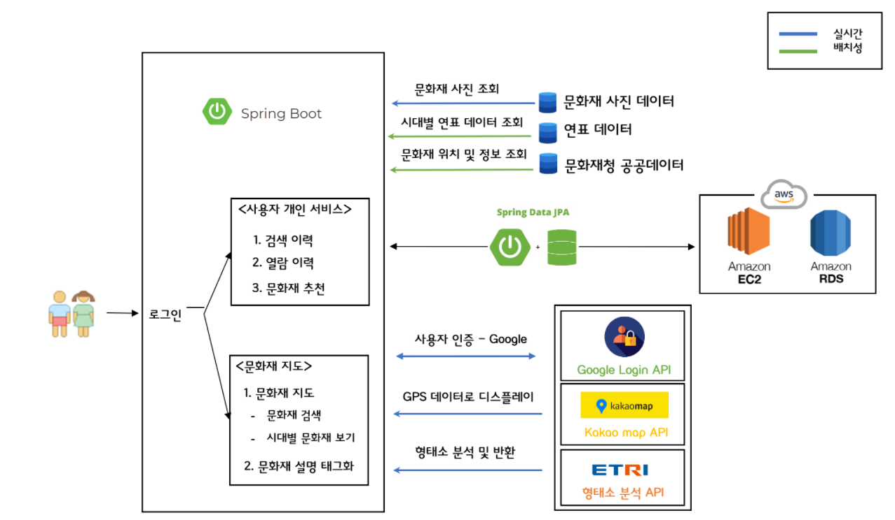
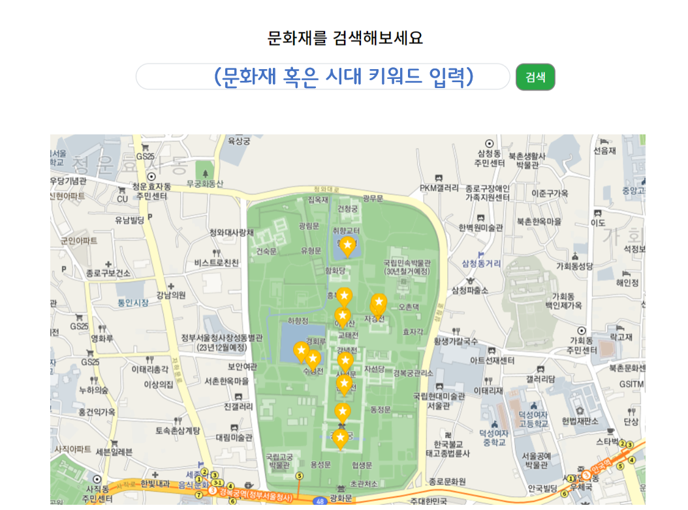

# 문화재 지도 프로젝트
이 프로젝트는 지도에서 문화재 위치를 확인하고, 마커를 클릭하면 문화재에 대해 상세하게 볼 수 있습니다.

### 활용 기술
- Spring Boot
- Spring Data JPA
- Google Login API
- Kakaomap API
- ETRI 형태소 분석 API

### 아키텍처



<hr/>





# 문화재 지도 프로젝트

## 프로젝트 진행 순서

### 기획 

### 데이터 파싱

### 아키텍처 설계

### ERD 작성

### 기능 명세 및 화면 설계

### 구현 및 테스트코드 작성

### 로그 관리 AOP 적용
- TimeTraceAop

### 추가 할 기능
- 스프링 배치를 활용한 데이터 관리
- 엘라스틱 서치를 활용한 문화재 Tag 관리 
- 검색 기능 고도화
- 운영과 검증 프로필 분리(AWS RDS Aurora DB와 H2 - Test DB로 분리)
- 세션 이해 및 구글 로그인 로직 수정
- 

### 실행 방법
1. h2 데이터베이스 테이블 생성
2. 데이터 넣기
```sql

ALTER TABLE heritage MODIFY(content	VARCHAR2(8000));

insert into heritage(no,ccba_ctcd_nm, ccma_name,ccsi_name,ccba_mnm1	,content,ccce_name,	ccba_lcad
)
select * from csvread('C:\Users\yooye\heritage.csv') -- 경로
;
select * from heritage;
```
3. h2 켜고 프로젝트 실행
